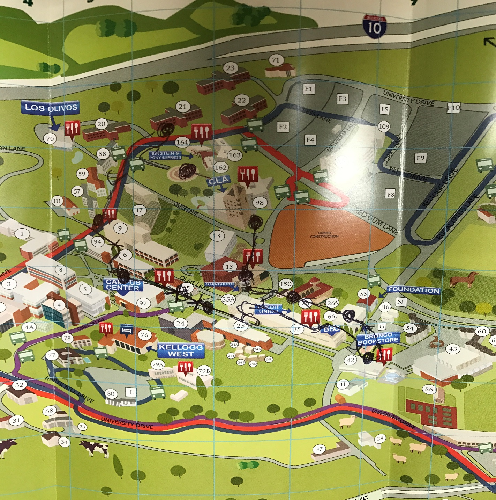
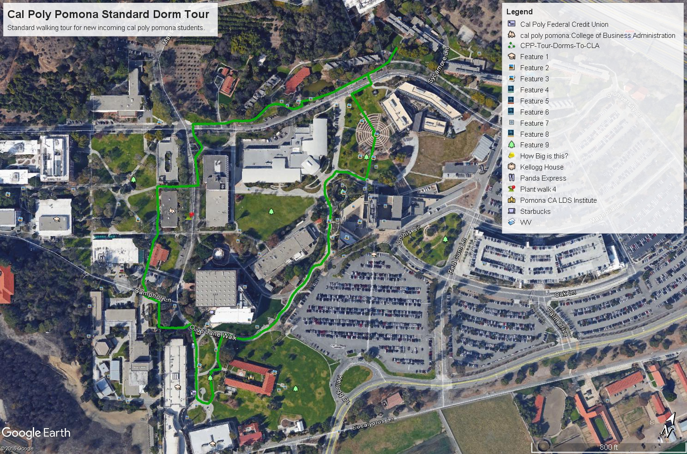
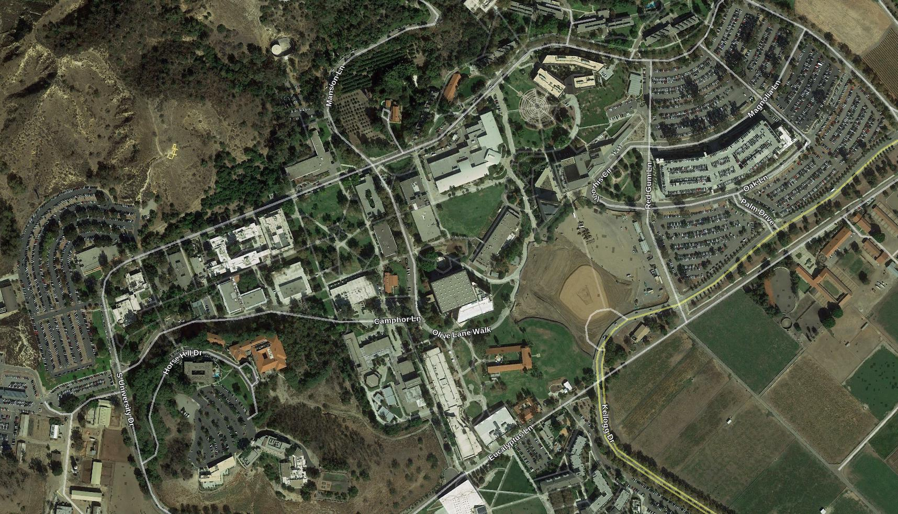
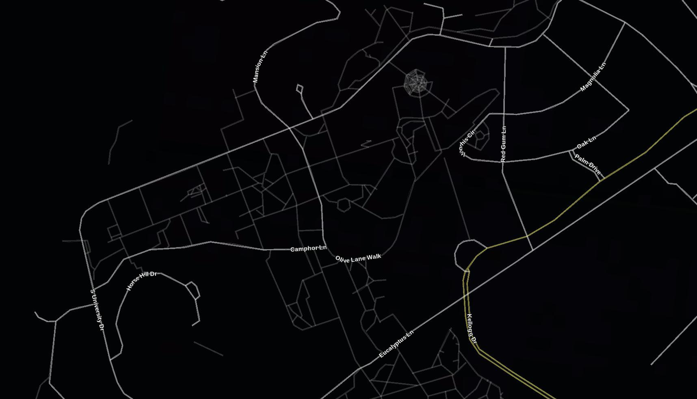
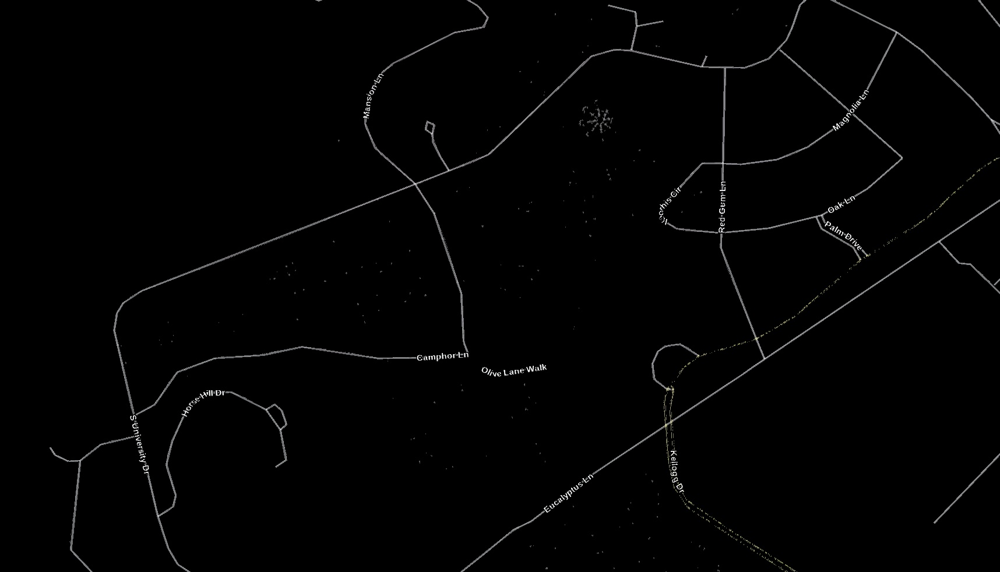
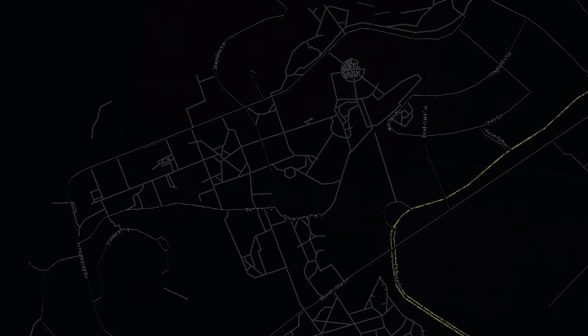
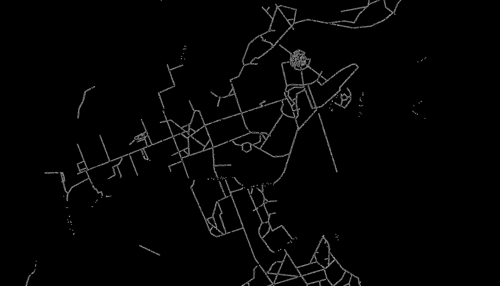

# CPP Husky A200 Mapping

Review Status: Not Reviewed

## Introduction

This is document covers the mapping component that was outlined within [Cal Poly Pomona's Self Driving Husky A200](https://github.com/cpp-self-driving-husky/cpp-husky-a200-design-doc). Mapping serves the purpose of providing a representation or map of Cal Poly Pomona's campus that could be used for routing the best path for traversal. In addition, it provides an environment in which the Husky can localize and find out exactly where it is in map.

## User Stories

* As a user, I want to be able to easily address any physical environmental changes in Cal Poly Pomona's Campus.

## Requirements

* The mapping solution must accurately reflect the Cal Poly Pomona's campus in real time.
* The mapping solution must only depict Cal Poly Pomona's campus. Nothing more and nothing less.
* The mapping solution must depict traversable and non-traversable paths the Husky A200 can take.

## Solution

The solution that is being proposed is to use a static map that can be provided as a KML, Keyhole Markup Language, file from Google Maps and Google Earth. Cal Poly Pomona's campus doesn't change frequently, thus it is appropriate to use a static map instead of implementing a dynamic mapping service.

The KML file will then be translated into a graph that can used for finding the shortest path.

If the map of Cal Poly Pomona ever changes then the KML map can be updated to reflect that information.

Another bonus for using a KML file is that the same KML file can be used on the UI and can also be loaded by the Google Maps API.

The creation of the paths that the husky/golf cart can travel will be implemented through Google Earth.

### Google Earth

Within Google Earth, paths can be placed on top of the image representation of Cal Poly Pomona. Unfortunately, only one path can be placed at a time and multiple paths cannot be connected to create one, however this can be solved by converting the lat/long points provided within the KML/KMZ files into lines and finding intersecting points. Those intersections can then be represented as a node that can be traversed.

#### Image Comparison

However, creating this path would take an immense amount of time. Not to mention, there are problems in regards to where the sidewalk is due to the obstruction of vision by trees and buildings.

#### Sidewalk Extraction

Fortunately, Google Earth provides a road layer that showcases both major roads and sidewalks. The sidewalks are a lighter shade of grey and also smaller in width.

Google Earth doesn't provide a way to remove the default satellite image. However, this can be circumvented by overlaying a black image.

The image aboves shows us both the major roads and sidewalks, however we are only interested in sidewalks that the husky/golf cart can traverse. This can be done manually, however would take too long.

With the assistance of computer vision, [OpenCV](https://opencv.org/), we can extract out the sidewalks, as the sidewalks are skinnier and a lighter shade of gray.

The goal is to remove the major roads and extract just the sidewalks from the image provided by google earth. The RGB value of the pixels will be used to determine whether it is a major road or sidewalk.

The major roads will be filtered first, so that we can perform a diff between the original image and the major roads.

The reason for this approach instead of just filtering the sidewalks right away is that the RGB values within the sidewalks are also found heavily around the edges of the major roads. This causes the major roads to still appear and requires us to make use of techniques such as [blurring](https://docs.opencv.org/2.4/doc/tutorials/imgproc/gausian_median_blur_bilateral_filter/gausian_median_blur_bilateral_filter.html), [erosion and dilation](https://docs.opencv.org/2.4/doc/tutorials/imgproc/erosion_dilatation/erosion_dilatation.html). However, at that point we are directly modifying the roads that the golf cart will be traversing.

Instead, we perform blurring, erosion and dilation on the major road, as that road isn't going to be used by the golf cart. Leaving our interested path in its original state.

Unfortunately, there are some edge cases that have to be addressed. The names on the road are a different shade and size from the road. This causes one of sidewalks to disconnect, as the name of the road covered the connection of the sidewalk.

However, the major road is for the most part removed from the original image.

Finally, we can detect the edges for our sidewalks.

#### KML/KMZ

The corresponding images above are translated as a KML/KMZ file. This file is similar to XML and contains information on the paths that was pinpointed on Google Earth. These lat/long points can be used to create lines that can be used to find intersections of lines. The intersections of lines will represent a point that can be traversed by the husky/golf cart.

#### Concerns/Issues

The creation of the paths can be done manually within Google Earth. As such, it takes a while to create these points.

In addition, not all of the paths will be 100% perfect. It will take a bit of trial and error in order to get paths that should not force the vehicle to have to heavily rely on its sensors to follow the paths.

Finally, there are many paths that need to be discussed by the faculty/teams to determine if it is a proper path or not. It is proper to have those portions of the path by documented. Most likely issues will be used to keep track of these.

#### Modifications

Editing or adding paths to the corresponding image above is simple.

The KMZ file is loaded into Google Earth, and all the paths specified should show up.

Please look at the references below for adding points.

## Reference

1. [Graph building based on Google Maps and Google Earth. Might need CPP internet access.](http://ieeexplore.ieee.org/document/7028728/)
2. [KML](https://developers.google.com/kml/)
3. [Google Map of Cal Poly Pomona](https://www.google.com/maps/d/u/0/viewer?mid=1RdxeCoUTop2E_mOp6rXrVYvnFDM&hl=en_US&ll=34.05797943205995%2C-117.82245283392047&z=17)
4. [Robotic Mapping](https://en.wikipedia.org/wiki/Robotic_mapping)
5. [How to export data from google earth](https://www.uvm.edu/~swac/docs/mod7/Exporting.pdf)
6. [How to create path in google earth](https://support.google.com/earth/answer/148072?hl=en)
7. [OpenCV](https://opencv.org/)
8. [OpenCV Python Tutorials](https://docs.opencv.org/3.0-beta/doc/py_tutorials/py_tutorials.html)